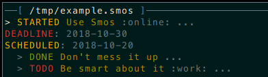

# Smos

A semantic tree-based editor to replace Emacs Org Mode

## A replacement for emacs org mode

Smos intends to deprecate Emacs org mode by being more robust, more
customisable, by providing a better and more tool-friendly file
format and by using a more sane configuration language.

## Completely customisable

Smos is first and foremost a library with which you can build your own version.
It is similar to XMonad in this respect.
See [the default configuration](smos/src/Smos/Default.hs)
for an example of a configuration.

## Future-proof file format

The Smos file format (`.smos`) is completely future proof because it is just
a subset of YAML:



``` smos
- entry:
  header: Use Smos
  timestamps:
    DEADLINE: 2018-10-30
    SCHEDULED: 2018-10-20
  state-history:
  - new-state: STARTED
    timestamp: 2018-10-10 14:19:53.988042844000+0000
  tags:
  - online
forest:
- header: Don't mess it up
  state-history:
  - new-state: DONE
    timestamp: 2018-10-10 14:19:54.388413954000+0000
- header: Be smart about it
  state-history:
  - new-state: TODO
    timestamp: 2018-10-10 14:19:54.796427564000+0000
  tags:
  - work
```

This format is very easy to work with programmatically, and convenience
functions in the `smos-data` library are provided to operate on Smos data.

## Great for version control

Files are made to make git diffs easy and disjoint.
Derived data is never stored, but instead computed or rendered with `smos-report`.

## Installation

Clone the repository:

```
$ git clone https://github.com/NorfairKing/smos
```

Use [Stack](haskellstack.org) to install Smos with the default configuration:

```
$ stack install :smos
```

Should you wish to change the key controls, you can do this by making your own
little Haskell project (also with stack), define the configuration you want to
use and pass it to the [`smos`](https://github.com/NorfairKing/smos/blob/development/smos/src/Smos.hs#L29)
library function.
